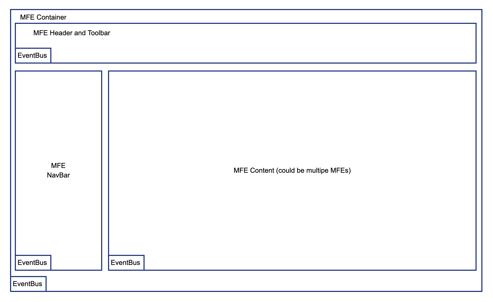

# mfe-container
Main container App which hold 4 MFEs

### Requires Running MFEs

- mfe-header
- mfe-navbar
- mfe-content-1
- mfe-content-2



### TODO

- add routing
- add nested MFE(s)
- add authentication
- add shared Context

## Running

```
yarn install
yarn start
```

webpack server will start on port 8001 http://localhost:8001

if nothing shows up then you are not running the other MFE instances :-)

## Deploying to AWS

This is a bit tricky but possible

create a new file

```
  touch .env.script
```

then edit and add the following with the proper values from AWS

```
  DISTRIBUTION=<AWS Distribution ID>
  S3_BUCKET=<AWS Bucket Name>
  DOMAIN=<DOMAIN NAME>
```

this will generate a production index.html file